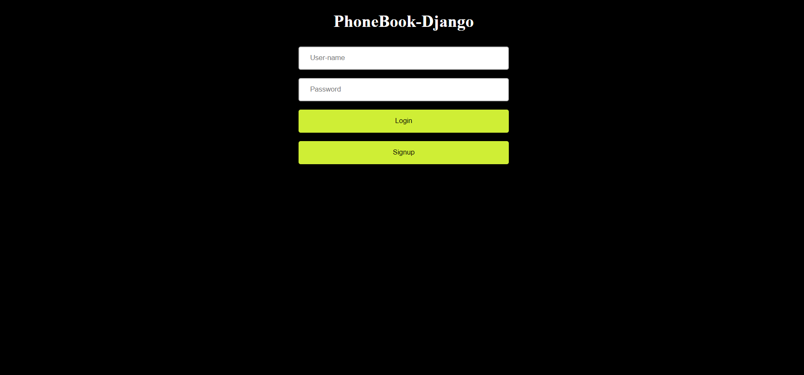
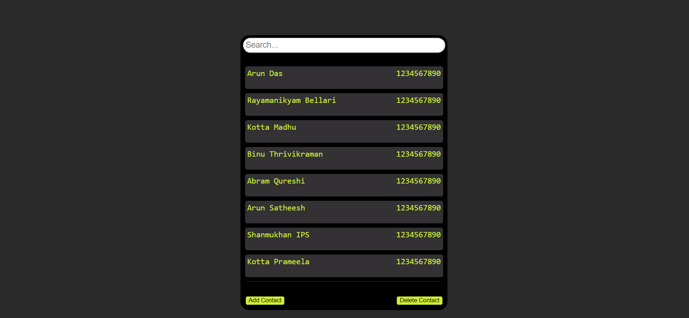
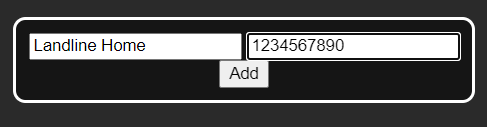
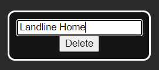
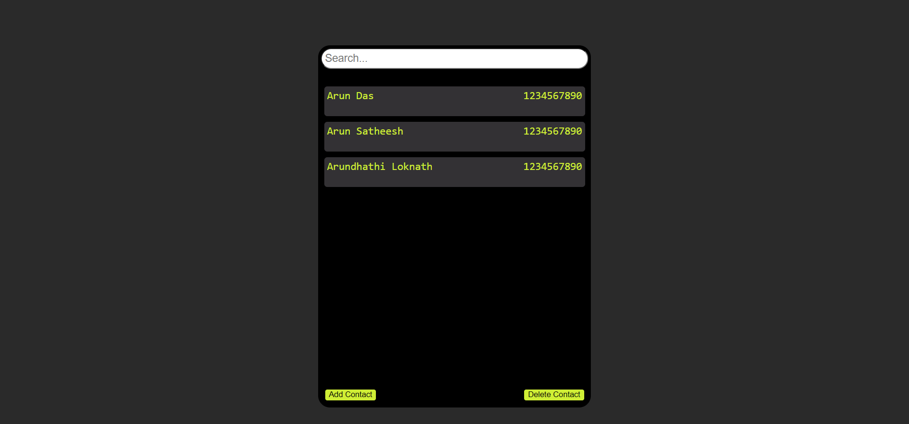

# PhoneBook-Django
A Django project to implement a phonebook web server where you can save, add and delete your contacts. If you are a beginner in django this could be a good first django project for you that can help you learn the basics of django.<br>
Disclaimer : As I myself am a beginner in django during the creation of this, I might be using some of the worst web/django development practices.<br>
All that being said, let's get started.<br><br>

# About
We are going to create a web server with the following functionalities,<br>
1. Users will be able to log-in/sign-up into their accounts.<br>
2. See all the contacts saved in their account.<br>
3. Add new contacts into their account.<br>
4. Delete contacts from their account<br><br>

***
**1. Creating a virtual environment**<br><br>
Whenever working on python, it's a good practice to create a virtual environment for each projects so that each of them could use any versions of any modules.<br>
First I create a project folder called 'PhoneBook', and another folder called 'py-venv' in it. Then I opened cmd in their and used the following command to create a python virtual environment,
```
python -m venv .
```
Activate the virtual environment by running the **activate.bat** file in the **Scripts** folder 
```
Scripts\activate.bat
```
<br></br>
**2. Installing Django**<br><br>
Install django in your virtual environment using the following command,
```
pip install django
```
<br></br>
**3. Creating a new django project**<br><br>
Go back to 'PhoneBook' folder and type in the following command to create a new project,
```
django-admin startproject PhoneBook .
```
This would have created 'manage.py' which is a command line utility for your django project, and another 'PhoneBook' folder which we can call our project folder. Inside the project folder we have files like :<br>
* __init__.py - to tell python that this is a module/package.
* urls.py - where we define different url patterns to help our web server route traffic.
* settings.py - different project settings are defined here.
<br></br>


**4. Create a new django application**<br><br>

An application in django is a logical container for let's say a certain part of your website. It contains different related functions (views in django) and templates (html templates/layouts) and other related things for your app. For our simple project a single app would suffice. Let's create an app called 'home' using the following command,
```
py manage.py startapp home
```
This would create a folder called 'home' with different files like,
* models.py - contains definitions for different models to be stored in your database.
* views.py - contains definitions for different functions to be used in your website.
<br>
Now create two new files 'urls.py' and 'templates' folder in your app to define url patterns and to store html files for your app.<br>
We also need to add our newly created app in the 'INSTALLED_APPS' list in the 'settings.py' file in our project folder so that django recognizes our new app.<br><br>

**5. Creating data models**<br><br>

We'll need to save the contact details for different users, also we'll need to save certain user details like username and password for each user. Django does provide an in-built User model that'll be more secure and also has many functions for user authentification, email verification etc. But for this project I'll be using my own user model.<br>
First let's create a User model in 'models.py' in 'home' folder with two fields for username and password. Remember it's not good practice to store password in the database un-encrypted. But for the simplicity of the project we don't encrypt password.
```python
class User(models.Model) :

    uname = models.CharField(max_length=30)
    pwrd = models.CharField(max_length=30)
```
Next we need a model to save contact details for various contacts of a user. We see a one-to-many relation here, each user can have multiple contacts. So we create a Contact model with User being a foreign key.
```python
class Contact(models.Model):
    user = models.ForeignKey(User, on_delete=models.CASCADE)
    name = models.CharField(max_length=30)
    phone_number = models.CharField(max_length=15)
```
`on_delete=models.CASCADE` is used so that all contacts mapped to a user gets deleted when the particular user gets deleted.<br>
Now that we've defined our models, we need to add them to our database. By default django uses sqlite3 database, we'll be using the same. Run the following commands to add these models to the database.
```
py manage.py makemigrations home
py manage.py migrate
```
<br></br>
**6. Create HTML templates**<br><br>

Add html files for our login/signup page and the home page. We can add logics in our templates in django, for example,
```html
<form method="post" action="">
```
Here django will replace the url for action parameter with the path of a url named 'checkLogin' which we will define later.
```html

                
    <div class="inner_div">
        <span>{{c.name}}</span>
        <span class="phone">{{c.phone_number}}</span>
    </div>


```
Here it iterates through a variable 'contacts' which in our case will be a list of Contact model objects. We'll pass this contacts variable as context when we try to render this template later.
<br></br>

**7. Create functions or views**<br><br>

In the 'views.py' file of 'home' app, I have created functions like,
* load() - to load the initial 'main.html' template.
* login() - to check the login credentials and login the user.
* signup() - to create a new user and sign them up.
* add() - to add contacts.
* dele() - to delete contacts.
* search() - to search for contacts with names starting with a particular string.

<br>
I'll try to explain different parts of 'views.py'<br>
The login() function will recieve a POST request containg two strings named 'username' and 'password'. This is from our html form in 'main.html'.
We can access these strings in the POST request by

```python
request.POST["username"]
request.POST["password"]
```

We can find the user with that particular username by

```python
User.objects.get(uname=request.POST["username"]
```

We can get all the contacts of that user by

```python
Contact.objects.filter(user=User.objects.get(uname=request.POST["username"])
```

We render the 'home.html' template using `render()` function, we also pass a context dictionary to `render()` so django can use it to replace variables in the template.<br>

We can create a new model object like,

```python
User.objects.create(uname=request.POST["username"], pwrd=request.POST["password"])
```

We can delete a particular record in the database like,

```python
Contact.objects.filter(user=u, name=request.POST["name"]).delete()
```
<br></br>

**8. Defining URL patterns**<br><br>

Initially all requests to the server will be dealt by the 'urls.py' file in the project folder. So we'll define some url patterns int his file to route the incoming requests
```python
path('', views.login)
```
This means that all requests having just the root url will be sent to a function 'login'.
```python
path('login/', include('home.urls'))
```
This means that if a request url is of the pattern 'rooturl/login/...' then the rest of the part of the url (ie; after login/) will be checked with the 'urls.py' file of 'home' app. So now we define certain url patterns in 'urls.py' in 'home' folder.
```python
path('', views.checkLogin, name="checkLogin"),
path('add', views.add, name='add'),
path('del', views.dele, name='del'),
path('search', views.search, name='search')
```
They will be matched with login/, login/add, login/del, login/search respectively.

<br></br>
**9. Running server**<br><br>

Run the server with the following command,
```
py manage.py runserver
```
<br></br>

**10. Results**<br><br>



Login/sign-up page<br><br>
<br>
Home page<br><br>
<br><br>
Form to add a contact
<br><br>
Form to delete contact
<br>
Search result for text="Arun"


